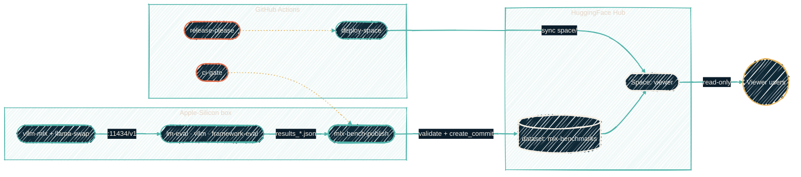
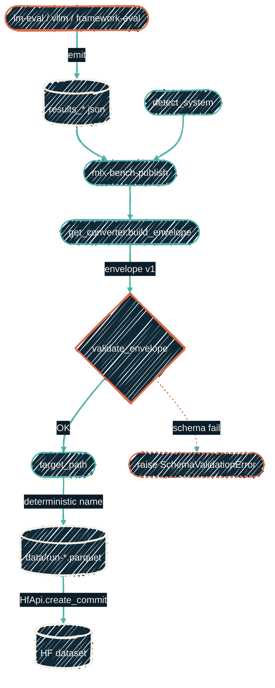
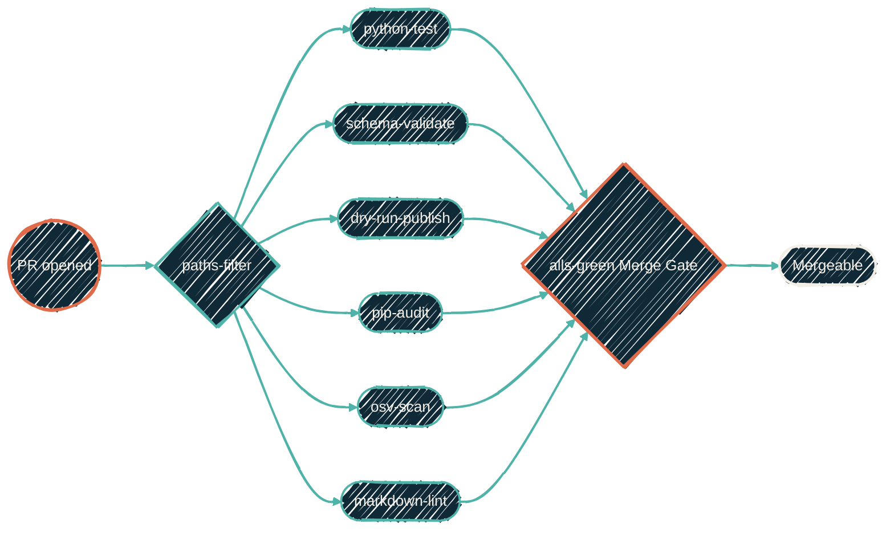

# Architecture

High-level data flow, from "I kick off a benchmark" to "I see a chart".

## System topology



## Components

### Inference layer

`vllm-mlx` served via `llama-swap` on port 11434. OpenAI-compatible; every
tool in this repo talks to it via `http://localhost:11434/v1/chat/completions`.
Model switching is handled by `mlx-switch` / `sync-mlx-models` outside this
repo.

### Evaluation layer

Everything under `configs/` (TOML per suite) plus inline scripts in
`harness/framework-eval/`. TOML configs are consumed directly by the upstream
tool (`lm_eval --config`, etc.). No config-to-arg translation layer lives
here; the TOML is the runbook.

### Publisher (`src/mlx_benchmarks/`)

Pure-Python, no Apple-Silicon dependencies. Converts raw tool output into
the envelope v1 shape, validates it against `schema.json`, serializes to
Parquet, and uploads via `HfApi.create_commit` with a deterministic
content-addressed filename pattern:

```text
data/run-<ISO-timestamp>-<git_sha>-<suite>-<model_slug>.parquet
```

This guarantees idempotent re-publishes and no overwrites. The envelope
validator is invoked inside `publish()` — you cannot accidentally ship a
non-compliant shard.

#### Data flow: results.json → published shard



The gate-shaped `validate_envelope` step is mandatory: every shard that
reaches `target_path()` has passed `schema.json` validation. There is no
`validate=False` bypass in real runs.

### Viewer (`space/`)

Gradio app that reads every `data/*.parquet` shard via `HfFileSystem`,
caches for 10 minutes, and renders three tabs (bar / trend / pivot).
Deployed to HF Spaces by `.github/workflows/deploy-space.yml` on `main`
pushes that touch `space/`.

### CI

| Workflow | Trigger | Purpose |
| --- | --- | --- |
| `ci-gate.yml` | PR | Single merge gate (see below). |
| `deploy-space.yml` | main push to `space/**` | Sync viewer to HF Space. |
| `release-please.yml` | main push | Conventional-commits releases via the `JacobPEvans/.github` reusable workflow. |

`ci-gate.yml` detects file changes and conditionally runs:

- `python-test` (ruff + mypy + pytest matrix)
- `schema-validate` (Draft-07 + TOML)
- `dry-run-publish` (publisher round-trip on fixture)
- the central reusables `_python-security.yml` (pip-audit), `_osv-scan.yml`
  (OSV lockfile scan), `_markdown-lint.yml`, `_file-size.yml`.

The final `Merge Gate` step (`re-actors/alls-green`) is the only required
check in branch protection.



Each job is skipped when paths-filter detects no relevant file changes,
but the Merge Gate still requires every job's status to be `success` or
`skipped` — it cannot pass on `failure`. This is what lets the polish
PR ship with only `markdown-lint` actually executing.

CodeQL Python + Actions scanning is provided by GitHub's
**default CodeQL setup** (repo Security settings), not by a workflow file in
this repo. A previous attempt to add a custom `codeql.yml` workflow conflicted
with the default setup ("CodeQL analyses from advanced configurations cannot
be processed when the default setup is enabled") and was removed.

## Reproducibility contract

A published shard records the full context needed to replay:

- `git_sha` — state of this repo at run time.
- `system.*` — OS, chip, memory, plus (optional) `python_version`,
  `mlx_version`, `mlx_lm_version`, `lm_eval_version`, `kernel`.
- `gen_kwargs` — generation hyperparameters passed to the inference API.
- `seed` — when the run was seeded.
- `model_revision` / `quantization` — model-side metadata when reported.

The CLI fills these in automatically; never hand-curate unless you know why.

## Non-goals

- Running benchmarks in CI. MLX requires macOS on Apple Silicon; GitHub's
  macOS runners do not offer the hardware cheaply enough. CI tests the
  **publisher**, not the benchmarks themselves.
- A custom benchmark harness. If a measurement is possible via an existing
  upstream tool, wire the tool — do not reimplement.
- Overwriting history. Published shards are immutable; a new run becomes a
  new shard.
